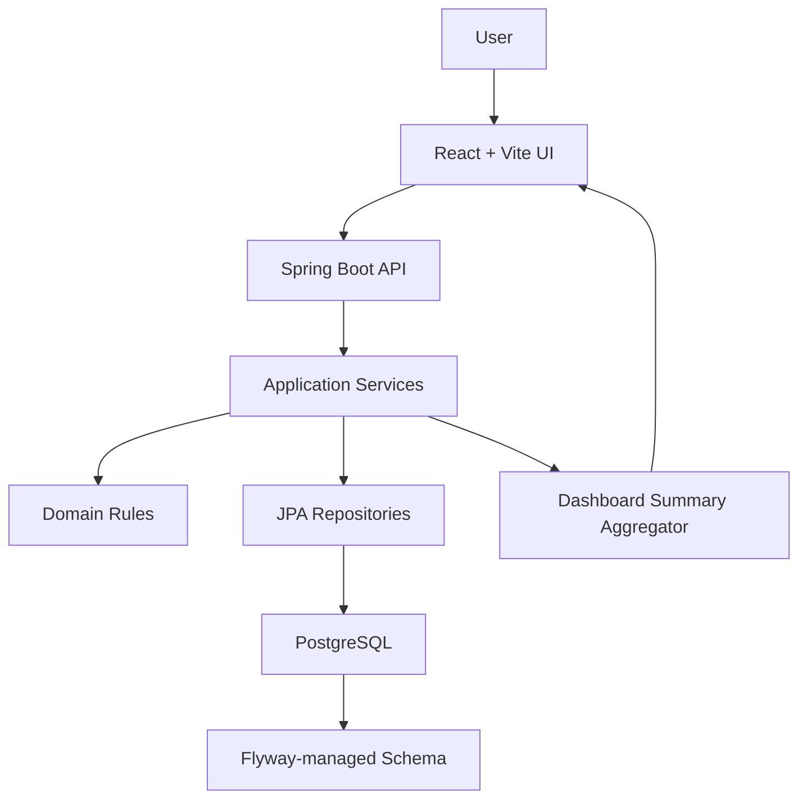

# TranquiloOS Architecture

## Modules

TranquiloOS is organized as a Spring Boot modular monolith with feature modules:

- `users`: registration, login, JWT-backed identity, profile.
- `scenarios`: move-out scenario model and summary.
- `expenses`: expense categories and scenario expenses.
- `scoring`: score snapshots, score factors, and risk factors.
- `recommendations`: deterministic recommendation generation and actions.
- `decisions`: decision event timeline.
- `comparison`: scenario comparison and scenario selection.
- `transport`: manual transport options and evaluation.
- `home`: home setup catalog and user purchase roadmap.
- `modes`: adaptive mode catalog and activations.
- `meals`: meal catalog and suggestions.
- `dashboard`: command center aggregation.
- `admin`: internal admin endpoints, audit log, settings, copy, import/export.
- `settings`: system setting persistence.
- `shared`: security, error handling, common infrastructure.

Frontend modules mirror the product areas under `frontend/src/features`.

## Data Flow



The frontend presents data and submits user actions. The backend owns decision logic.

Examples:

- Score is calculated by `ScenarioScoreService`.
- Recommendations are generated by backend recommendation services.
- Scenario comparison is performed by `ScenarioComparisonService`.
- Transport fit is evaluated by `TransportEvaluationService`.
- Dashboard summary aggregates existing backend data instead of recalculating domain rules in React.

## Key Decisions

### Why Modular Monolith

The MVP has many domains, but they are tightly connected around one user journey.

Using one Spring Boot app keeps:

- Deployment simple.
- Transactions local.
- Ownership checks consistent.
- Flyway migrations easy to reason about.
- Local development fast.

The package structure still preserves boundaries between users, scenarios, expenses, scoring, recommendations, home setup, modes, meals, decisions, comparison, transport, dashboard, and admin.

### Why Not Microservices

Microservices would add network boundaries, distributed auth, deployment orchestration, observability needs, and data consistency problems before the product has enough scale to justify them.

For this MVP, the harder problem is product correctness, not service distribution.

### Why Rules Before AI

The user needs explainable guidance:

- Why is this scenario fragile?
- Why is this recommendation first?
- Why is this transport option not ready?
- Why should this purchase be postponed?

Deterministic rules make those answers testable, auditable, and easier to demo. AI can be considered later as an assistant layer, but the core decision engine should remain clear and dependable.

## Persistence

Core entities are relational:

- users
- profiles
- scenarios
- expenses
- score snapshots
- risk factors
- recommendations
- home setup items
- modes
- meals
- decisions
- transport options
- admin settings

Money uses PostgreSQL `NUMERIC` and Java `BigDecimal`.

JSONB is limited to:

- score input snapshots
- recommendation context
- decision context
- admin audit before/after snapshots
- import/export metadata

## API Style

Controllers are thin and delegate to services.

Services handle use cases, validation boundaries, ownership checks, persistence, and decision rule orchestration.

Global error handling returns consistent API errors for validation, unauthorized access, not found, conflicts, and unexpected failures.

## Deployment

Development:

```bash
docker compose up --build
```

Private prod-like:

```bash
docker compose -f docker-compose.prod.yml --env-file .env.prod up --build -d
```

Health:

```bash
./scripts/check-health.sh
```

Backups:

```bash
./scripts/backup-db.sh
./scripts/restore-db.sh backups/<file>.sql
```

